# Frontend Mentor Challenges

Repositório com todos os desafios que resolvi do site [Frontend Mentor](https://www.frontendmentor.io/profile/isabellatressino).

## Product preview card component

  
Ver imagem

 

- [Repositório](https://github.com/isabellatressino/frontendmentor-challenges/tree/main/product-preview-card-component-main)
- [Live Site](https://isabellatressino.github.io/frontendmentor-challenges/product-preview-card-component-main/)

## 3 column preview card component main

  
Ver imagem

 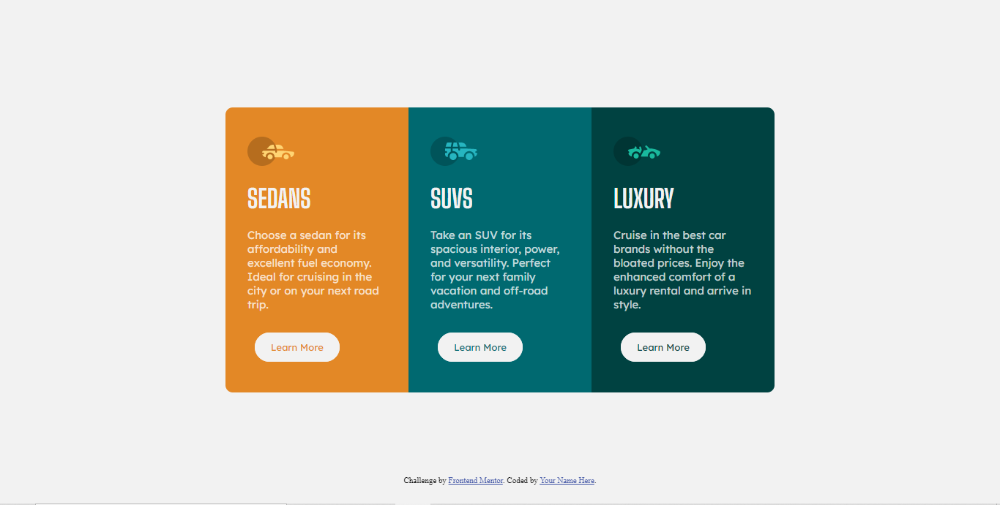

- [Repositório](https://github.com/isabellatressino/frontendmentor-challenges/tree/main/3-column-preview-card-component-main)
- [Live Site](https://isabellatressino.github.io/frontendmentor-challenges/3-column-preview-card-component-main/)

## Nft Preview Card Component

  
Ver imagem

 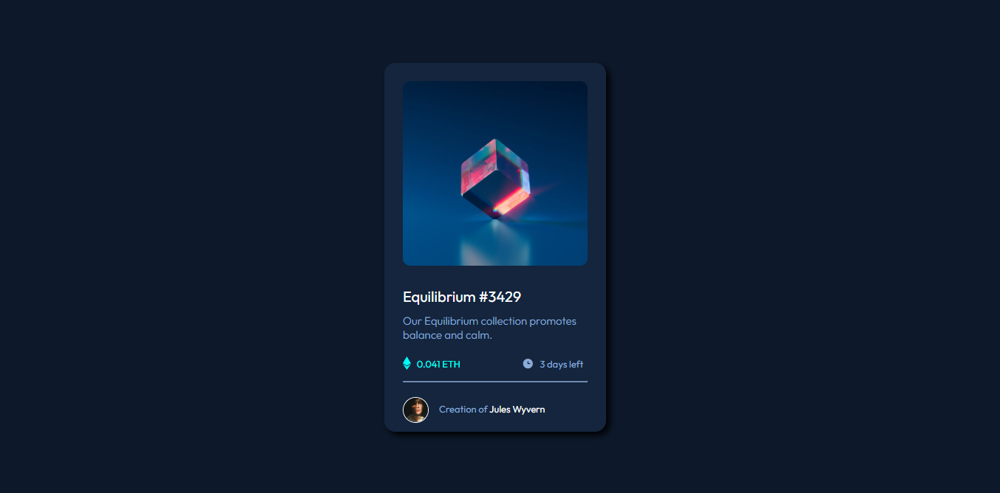

- [Repositório](https://github.com/isabellatressino/frontendmentor-challenges/tree/main/nft-preview-card-component-main)
- [Live Site](https://isabellatressino.github.io/frontendmentor-challenges/nft-preview-card-component-main/)

## Stats Preview Card Component

  
Ver imagem

 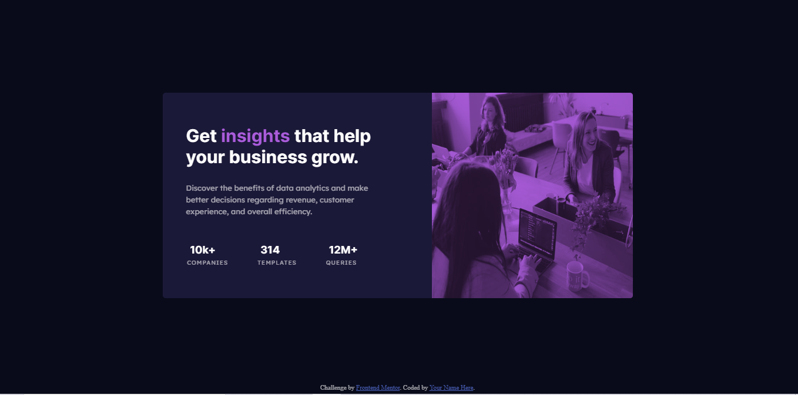

- [Repositório](https://github.com/isabellatressino/frontendmentor-challenges/tree/main/stats-preview-card-component-main)
- [Live Site](https://isabellatressino.github.io/frontendmentor-challenges/stats-preview-card-component-main/)

## Single Price Grid Component

  
Ver imagem

 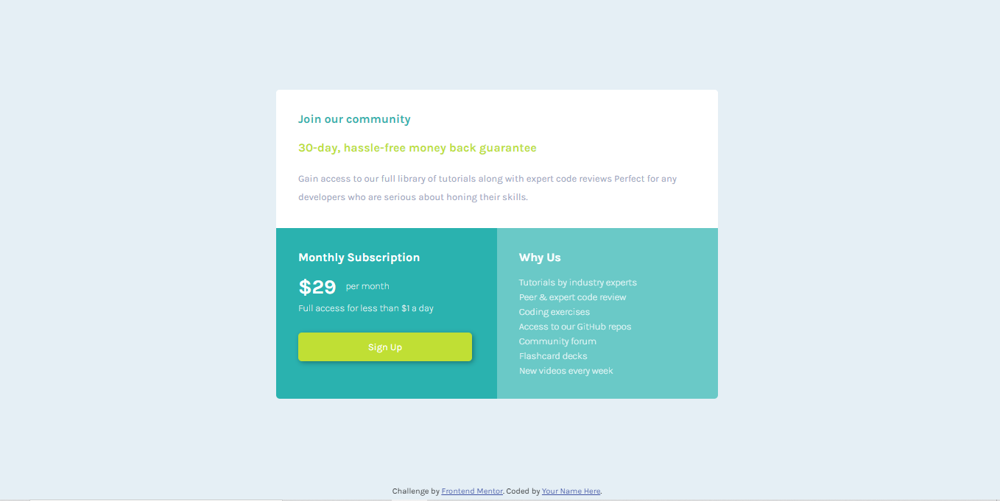

- [Repositório](https://github.com/isabellatressino/frontendmentor-challenges/tree/main/single-price-grid-component-master)
- [Live Site](https://isabellatressino.github.io/frontendmentor-challenges/stats-preview-card-component-main/)

## Huddle landing page with single introductory section master

  
Ver imagem

 

- [Repositório](https://github.com/isabellatressino/frontendmentor-challenges/tree/main/huddle-landing-page-with-single-introductory-section-master)
- [Live Site](https://isabellatressino.github.io/frontendmentor-challenges/huddle-landing-page-with-single-introductory-section-master/)

## Testimonials Grid Section

  
Ver imagem

 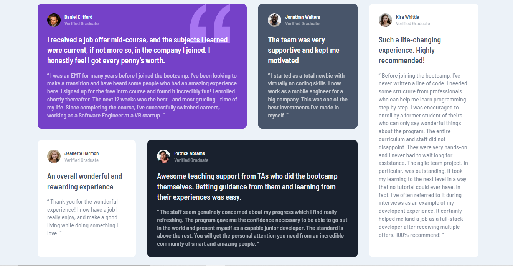

- [Repositório](https://github.com/isabellatressino/frontendmentor-challenges/tree/main/testimonials-grid-section-main)
- [Live Site](https://isabellatressino.github.io/frontendmentor-challenges/testimonials-grid-section-main/)

## Huddle Landing Page with alternating feature blocks

  
Ver imagem

 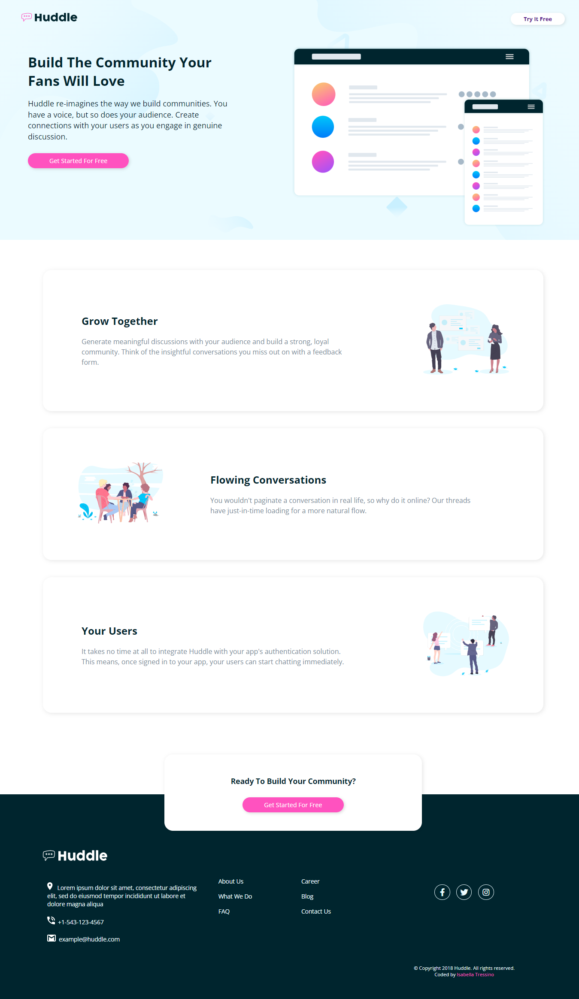

- [Repositório](https://github.com/isabellatressino/frontendmentor-challenges/tree/main/huddle-landing-page-with-alternating-feature-blocks-master)
- [Live Site](https://isabellatressino.github.io/frontendmentor-challenges/huddle-landing-page-with-alternating-feature-blocks-master/)

## Social Proof Section

  
Ver imagem

 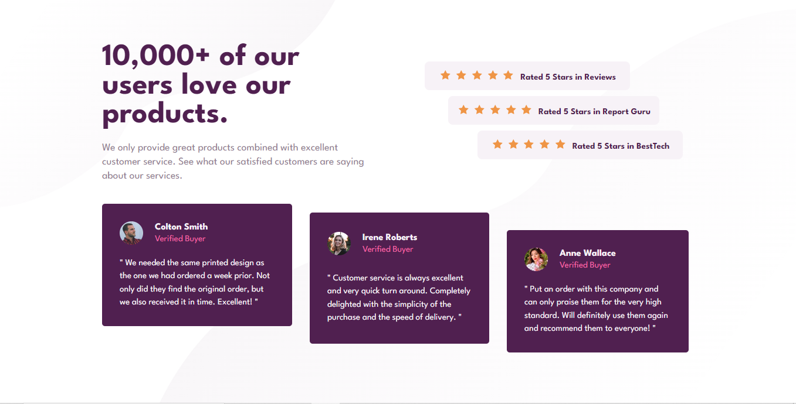

- [Repositório](https://github.com/isabellatressino/frontendmentor-challenges/tree/main/social-proof-section-master)
- [Live Site](https://isabellatressino.github.io/frontendmentor-challenges/social-proof-section-master/)

## Fylo Landing Page With Two Column Layout Master

  
Ver imagem

 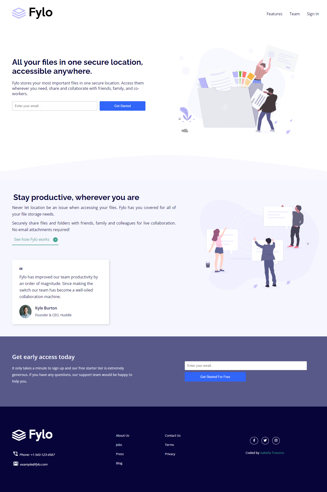

- [Repositório](https://github.com/isabellatressino/frontendmentor-challenges/tree/main/fylo-landing-page-with-two-column-layout-master)
- [Live Site](https://isabellatressino.github.io/frontendmentor-challenges/fylo-landing-page-with-two-column-layout-master/)

## Interactive Rating Component Main

  
Ver imagem

 

- [Repositório](https://github.com/isabellatressino/frontendmentor-challenges/tree/main/interactive-rating-component-main)
- [Live Site](https://isabellatressino.github.io/frontendmentor-challenges/interactive-rating-component-main/)

## FAQ Accordion Main

  
Ver imagem

 

- [Repositório](https://github.com/isabellatressino/frontendmentor-challenges/tree/main/faq-accordion-main)
- [Live Site](https://isabellatressino.github.io/frontendmentor-challenges/faq-accordion-main/)

## Newsletter Sign Up With Success Message Main

  
Ver imagem

 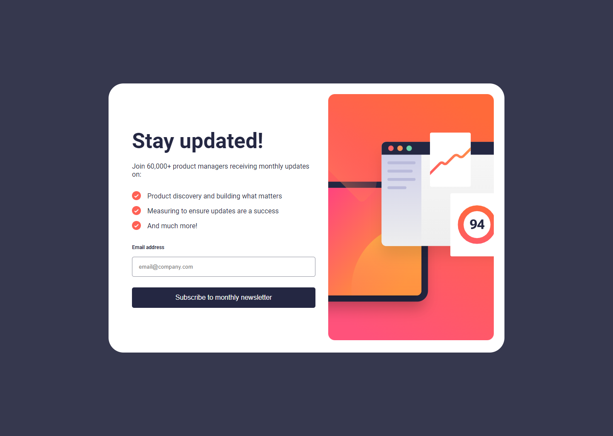

- [Repositório](https://github.com/isabellatressino/frontendmentor-challenges/tree/main/newsletter-sign-up-with-success-message-main)
- [Live Site](https://isabellatressino.github.io/frontendmentor-challenges/newsletter-sign-up-with-success-message-main/)

## Tip Calculator App Main

  
Ver imagem

 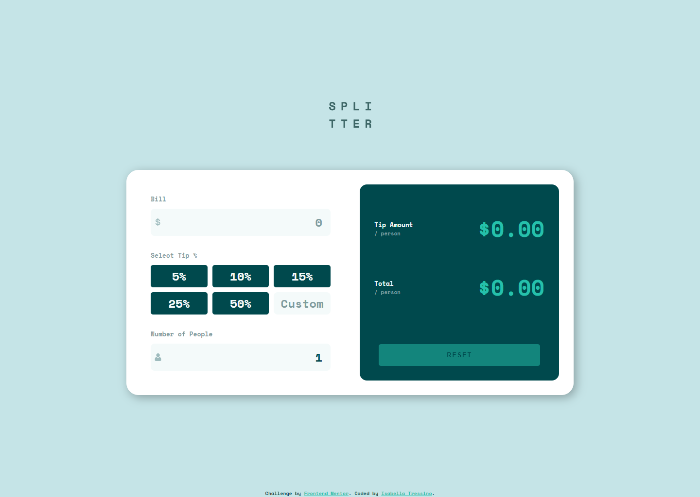

- [Repositório](https://github.com/isabellatressino/frontendmentor-challenges/tree/main/tip-calculator-app-main)
- [Live Site](https://isabellatressino.github.io/frontendmentor-challenges/tip-calculator-app-main/)

## Interactive Card Details Form Main

  
Ver imagem

 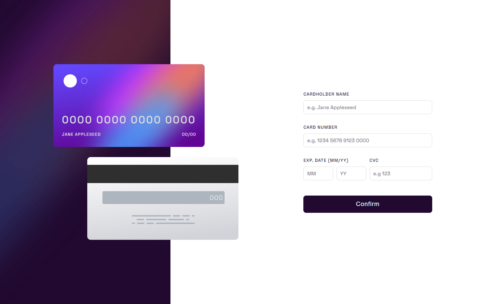

- [Repositório](https://github.com/isabellatressino/frontendmentor-challenges/tree/main/interactive-card-details-form-main)
- [Live Site](https://isabellatressino.github.io/frontendmentor-challenges/interactive-card-details-form-main/)
