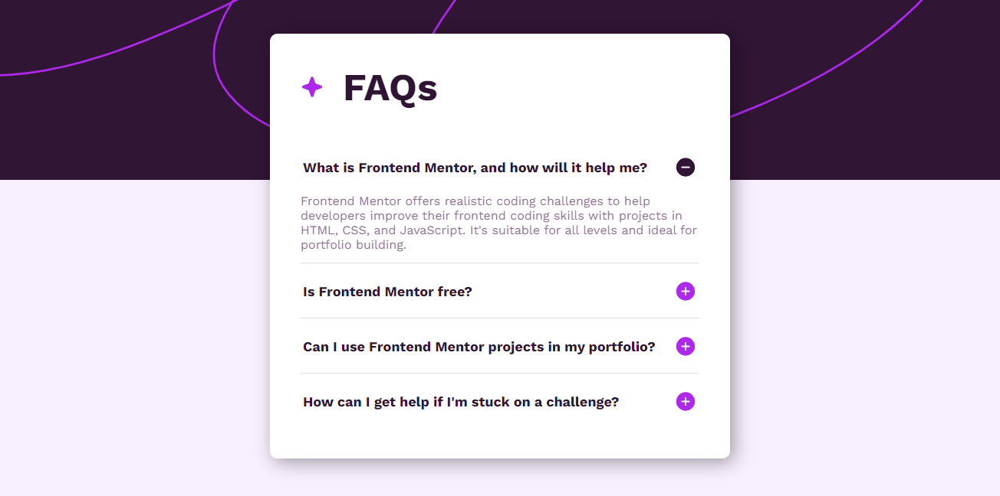

# Frontend Mentor - FAQ accordion solution

This is a solution to the [FAQ accordion challenge on Frontend Mentor](https://www.frontendmentor.io/challenges/faq-accordion-wyfFdeBwBz). Frontend Mentor challenges help you improve your coding skills by building realistic projects. 

## Table of contents

- [Overview](#overview)
  - [The challenge](#the-challenge)
  - [Screenshot](#screenshot)
  - [Links](#links)
- [My process](#my-process)
  - [Built with](#built-with)
  - [What I learned](#what-i-learned)
- [Author](#author)

## Overview

### The challenge

Users should be able to:

- Hide/Show the answer to a question when the question is clicked
- Navigate the questions and hide/show answers using keyboard navigation alone
- View the optimal layout for the interface depending on their device's screen size
- See hover and focus states for all interactive elements on the page

### Screenshot



### Links

- Solution URL: [https://www.frontendmentor.io/solutions/faq-accordion-main-bCuONBVsZq](https://www.frontendmentor.io/solutions/faq-accordion-main-bCuONBVsZq)
- Live Site URL: [https://isabellatressino.github.io/faq-accordion-main/](https://isabellatressino.github.io/faq-accordion-main/)

## My process

### Built with

- Semantic HTML5 markup
- CSS custom properties
- Flexbox
- CSS Grid
- Mobile-first workflow
- JavaScript

### What I learned

- CSS
```css
.ativo {
  animation: abrir 1s forwards;
}
@keyframes abrir {
  from {
    opacity: 0;
    height: 0;
  }
  to {
    opacity: 1;
    height: 160px;
  }
}
```

- JavsScript
```js
let classe = Array(answer.length).fill("inativo");
```

## Author

- Frontend Mentor - [@isabellatressino](https://www.frontendmentor.io/profile/isabellatressino)

